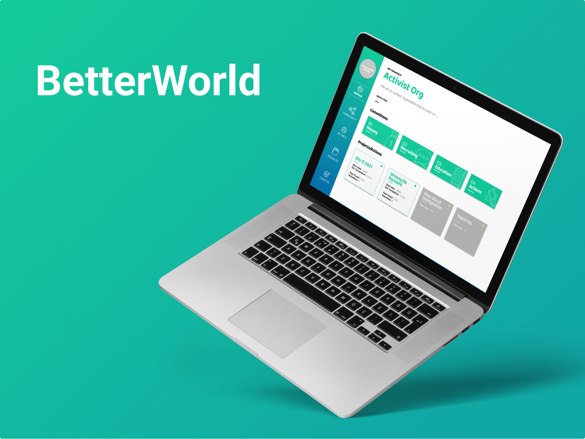

# Better World

**Better world is a platform for members of activist groups to organize their projects and more effectively work together.**

This is the implementation of the study done in 2020-2021 at Carnegie Mellon University by Daniel Le Compte, Connor Shannon, Amanda Crawford. The project is a co-design project along with a social justice student organization at CMU to create a tool that can help organize and promote group work. 

 

## Highlighted Features

### All The Projects In One Place
See all of your organization's current and past projects in one place.Know what’s been done before and what projects are currently active.

 

 

### Everyone On The Same Page
Stay up-to-date by seeing updates for each project. Respond to a help request to get started on a project. Quickly open documents from inside the site.

 

 

## Overiew
[Create React App Instructions](https://create-react-app.dev/docs/getting-started/)
- Built using React.js and Google Firebase
- App is initiated in App.js, all app-wide logic and interaction with firebase is set up in the App.js class through control context
- Src file contains all JSX files which contain client facing interface
  - /src/components/ contains the JSX files which can be directly modified as needed to build the pages needed
  - /src/components/UpdatesSection/ contains all the components and logic for creating, editing, deleting, viewing, and replying to updates. All of it is wrapped inside the UpdatesSection Component, which parses the url to find the updates relevant to each page.
- Assets are located at betterworld/src/assets

## Styles
- Global styling in the styles/global.css
- For the rest of app either use css modules or Styled components
- Code is designed to be self explaining and extended work should follow the set naming conventions

## Data Structure
- The site is served by a google Firebase database. Please see the Firebase fundamentals documentation here: https://firebase.google.com/docs/guides
- To best initiate your own firebase project, please use the JSON file included in the root directory of the project and use the firebase-export-import package to import the JSON into your own store https://firebaseopensource.com/projects/dalenguyen/firestore-backup-restore/
- Here is the layout of the current database:

## Next Steps
- address major bugs
- add admin settings and allow users to edit content
- add onboarding